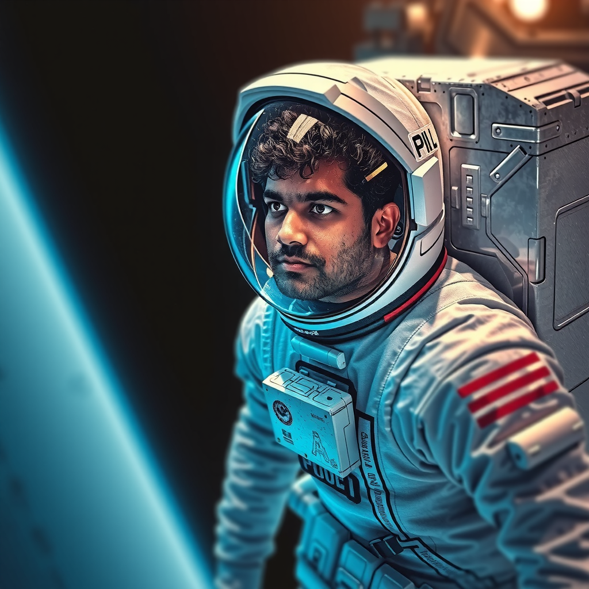
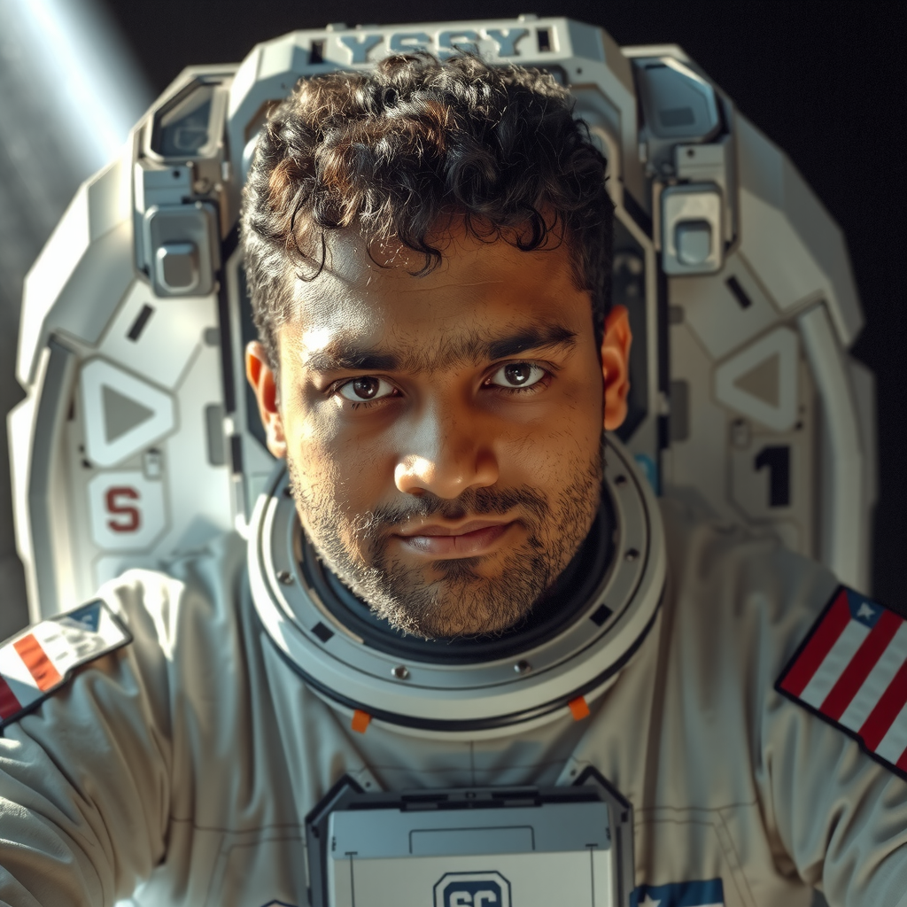
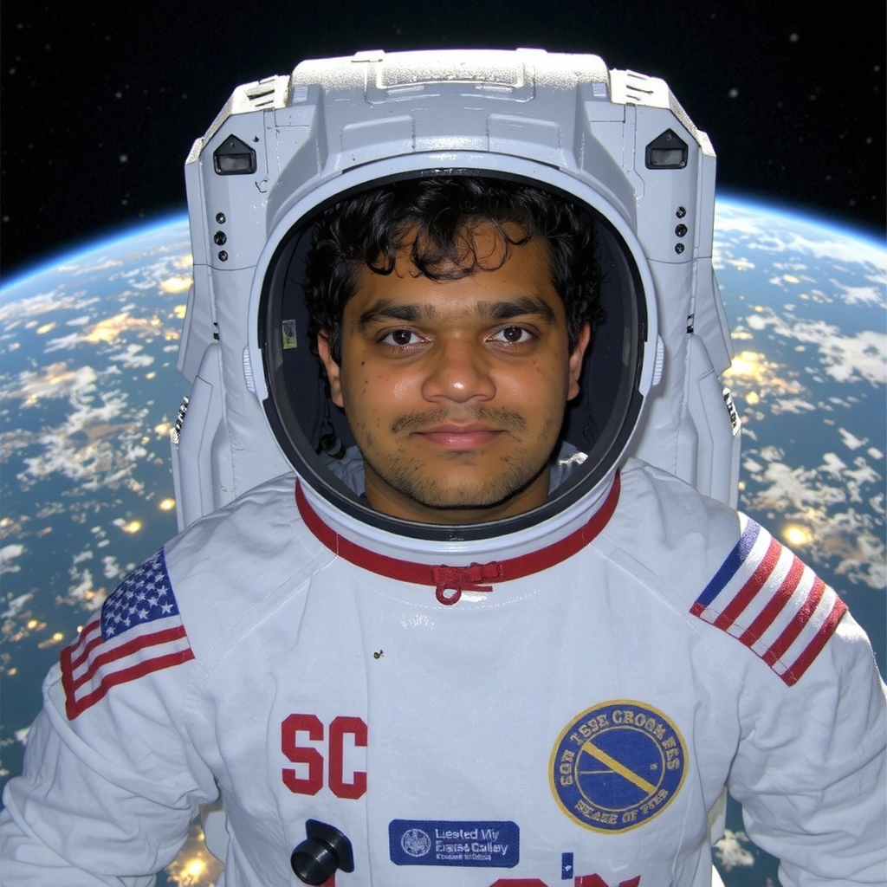
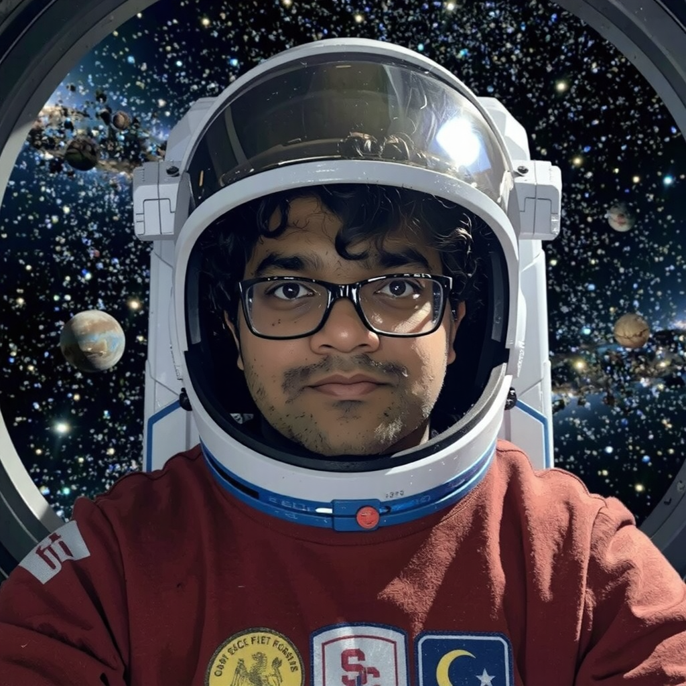

# Flux Schnell Diffusion Transformer Model Fine Tuning Across Hardware Configurations

## 🚀 Introduction to Diffusion Transformers

Diffusion Transformers (DiTs) are a novel type of models that combines ideas from diffusion models (often used in generative tasks like image generation) with transformers (widely used for sequence modeling and language tasks). They leverage the strengths of both approaches for various generative and modeling tasks

### How do they work?
- **Diffusion Process:** The model gradually adds noise to the data (e.g., image or text) in multiple timesteps and learns to reverse this noising process to generate clean data from random noise
  
- **Transformer Architecture:** A transformer-based model captures long-range dependencies in the data using self-attention, enhancing the generation process by modeling complex relationships

- **Iterative Denoising:** The model performs a series of denoising steps, progressively refining the data from noisy to clean through a learned reverse diffusion process

- **Conditional Generation:** Diffusion Transformers can generate data conditioned on other inputs (e.g., text-to-image generation), allowing for flexible and context-aware outputs

<br>

These models have demonstrated significant success in applications such as image generation, text-to-image synthesis, video generation, anomaly detection, and more

<p align="center">
  
  <br>
  <i>Diffusion Transformer Architecture (with different configs)</i>
</p>

<br>

## ⭐ Why fine tune across various hardware configs?

Tuning the flux schnell diffusion transformer model across various hardware configurations answers the following questions:

- How does the model performance scale with computational resources?
- How can finetuning be optimized for different hardware setups to make more efficient use of resources?
- What insights can be gained into the trade-offs between tuning time, output quality, and hardware costs in order to determine the best configuration for various scenarios?

<br>

## 🧑‍💻 Experimental Approach

- Hardware configurations used:

  1. **Nvidia A40 GPU on USC CARC**: 8 CPU Cores, 64GB RAM, 40GB VRAM
  2. **Nvidia A100 GPU on USC CARC**: 8 CPU Cores, 64GB RAM, 80GB VRAM

- For each configuration, I:
  - Fine tuned the model, closely monitoring loss and time taken
    - Fine tuning iterations: 500 and 2000 steps
  - Evaluated the generated outputs and assessed model performance

<br>

## 🖥️ How to run the fine tuning scripts on USC CARC

- Cluster used: <em>DISCOVERY</em>

### 1. Request resources using the following command
```bash
salloc --partition=gpu --ntasks=1 --cpus-per-task=8 --gpus-per-task=gpu(a40/a100):1 --time=time(suggestion: 04:30:00) --mem=64G
```

### 2. Create a python virtual environment and activate
```bash
virtualenv tune
source tune/bin/activate
```

### 3. Load the following modules
```bash
module load gcc/12.3.0
module load python/3.11.4
module load git
```

### 4. Clone Hugging Face [ai-toolkit](https://github.com/ostris/ai-toolkit/) repository
```bash
git clone https://github.com/ostris/ai-toolkit
cd ai-toolkit && git submodule update --init --recursive
```

### 5. Install dependencies (Tested on CUDA 12.1/12.2)
```bash
pip3 install torch torchvision torchaudio --index-url https://download.pytorch.org/whl/cu121

pip3 install -r requirements.txt
```

### 6. Create dataset
- Create a dataset directory at the root of the project
- Add min of 5 images along with accompanying captions in text files
- Follow the format : image_name.png, image_name.txt

### 7. Run the appropriate script (Tuning / Inference)
```bash
python tuning.py
or
python inference.py
```

## 📁 Dataset

The custom dataset I used contained five images of myself with accompanying text files with the following captions describing the subject and the image:
- [trigger] in a white hoodie and grey pants, in a park
- [trigger] in a black hoodie and blue shorts, on a pier at night
- [trigger] in a grey t-shirt and black shorts, in the ocean, wearing sunglasses
- [trigger] in a pink hoodie and black shorts, standing in front of a waterfall
- [trigger] in a white t-shirt, selfie, in a garden, wearing glasses

Here, `[trigger]` is the action word I use to associate the subject in the images

<br>

## 📝 Performance Evaluation

### 1. Model outputs at various checkpoints 
(Prompt: A man holding a sign that says, \'this is a sign\')

- ### A40 500 Steps
| | | |
|:-------------------------:|:-------------------------:|:-------------------------:|
| <br/> Iteration : 0| <br/> Iteration : 250| <br/> Iteration : 500|

- ### A100 500 Steps
| | | |
|:-------------------------:|:-------------------------:|:-------------------------:|
| <br/> Iteration : 0| <br/> Iteration : 250| <br/> Iteration : 500|

- ### A40 2000 Steps
| | | |
|:-------------------------:|:-------------------------:|:-------------------------:|
| <br/> Iteration : 0| <br/> Iteration : 250| <br/> Iteration : 500|
| <br/> Iteration : 750| <br/> Iteration : 1000| <br/> Iteration : 1250|
| <br/> Iteration : 1500| <br/> Iteration : 1750| <br/> Iteration : 2000|

- ### A100 2000 Steps
| | | |
|:-------------------------:|:-------------------------:|:-------------------------:|
| <br/> Iteration : 0| <br/> Iteration : 250| <br/> Iteration : 500|
| <br/> Iteration : 750| <br/> Iteration : 1000| <br/> Iteration : 1250|
| <br/> Iteration : 1500| <br/> Iteration : 1750| <br/> Iteration : 2000|

<br>

### 2. Inference Output

| | | | |
|:-------------------------:|:-------------------------:|:-------------------------:|:-------------------------:|
| <b>Prompt:</b> Pranav is an astronaut, in space (1) <br/><br/> <b> Hardware Configuration:</b> <br/> GPU: A40 <br/> CPU: 64GB RAM <br/> Iterations : 500| <b>Prompt:</b> Pranav is an astronaut, in space (2) <br/><br/> <b> Hardware Configuration:</b> <br/> GPU: A100 <br/> CPU: 64GB RAM <br/> Iterations : 500 | <b>Prompt:</b>  Pranav is an astronaut, in space (3) <br/><br/> <b> Hardware Configuration:</b> <br/> GPU: A40 <br/> CPU: 64GB RAM <br/> Iterations : 2000|  <b>Prompt:</b> Pranav is an astronaut, in space (4) <br/><br/> <b> Hardware Configuration:</b> <br/> GPU: A100 <br/> CPU: 64GB RAM <br/> Iterations : 2000|

<br>

### 3. Metrics (Keeping the number of tuning iterations constant)

#### a. Speedup

Ratio of fine tuning time taken by the slower GPU to the faster GPU

| | |
|:-------------------------:|:-------------------------:|
| 500 Steps| 2000 Steps|

- <em>Observation</em>: Average Speedup of 1.8x was observed when I used the A100
- <em>Analysis</em>: A100 offers a higher tensor core count (336 for A40 and 432 for A100), a significantly faster memmory bus (384 bit for A40 and 5120 bit for A100) and VRAM bandwidth (696GB GB/s for A40 and 1555 GB/s for A100). These factors attribute to its speedup and performance for fine tuning a large diffusion transformer

<br>

#### b. Inference Speed

Time taken by a tuned model to yield an image given a prompt. I observed inference time double across the two hardware configurations (34s for A40 and 17s for A100)

<br>

#### c. Loss Vs Iterations

- ##### 500 Steps


- ##### 2000 Steps


<br>

- <em>Observation</em>: Similar losses are observed in both cases 
- <em>Analysis</em>: Sample images generated during training and inference visually look very similar as shown in our image grid so I was expecting similar loss plots for both hardware configurations

<br>

### 4. Tuning Speed Calculations

| GPU | Steps | Runtime(s) | Tuning Speed (steps/s) |
| ------------- | ------------- | ------------- | ------------- |
| NVIDIA A100  | 500  | 1013 | 0.4936 |
| NVIDIA A100  | 2000  | 5236 | 0.3820 |
| NVIDIA A40  | 500  | 1744 | 0.2866 |
| NVIDIA A40  | 2000  | 9017 | 0.2218 |

<br>

## Performance Across Different GPUs

- **NVIDIA A100:** The A100 demonstrates consistent scaling, with the time per step remaining proportional across both step configurations. This indicates that the A100 handles the workload efficiently, maintaining a predictable scaling ratio 
- **NVIDIA A40:**  For 2000 steps, the runtime on the A40 is significantly longer than on the A100, suggesting that the A100 is more optimized for high-performance computations 